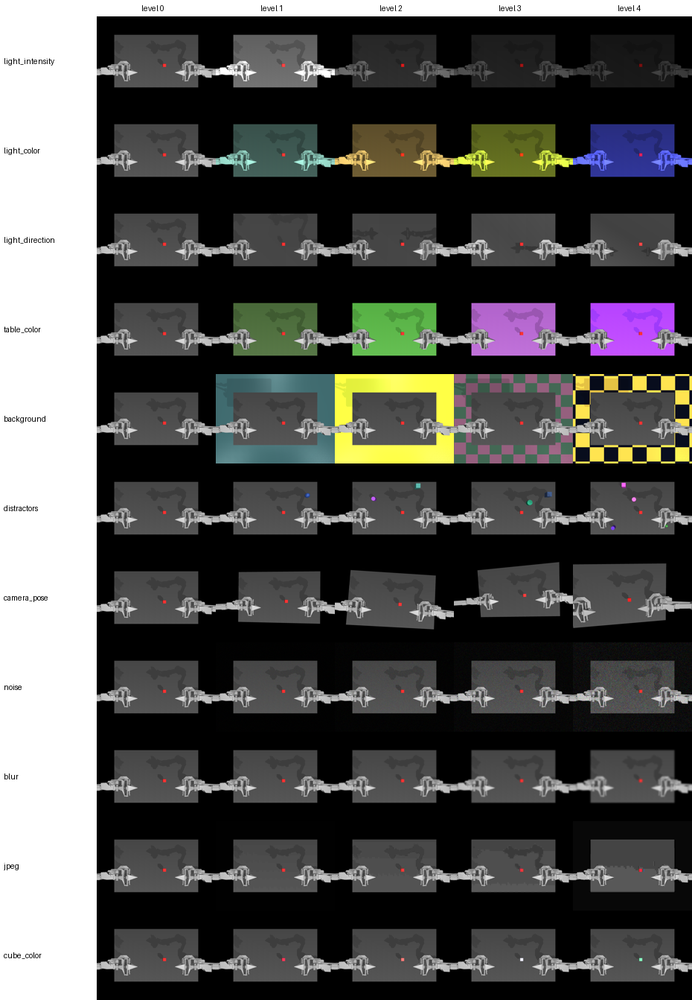

# How Robust Are Visuomotor Imitation Policies to Visual Shift?

Self-study final project following Stanford
[CS231n: Deep Learning for Computer Vision](https://cs231n.stanford.edu/) (Spring 2026 curriculum).

Imitation-learning policies like [ACT](https://tonyzhaozh.github.io/aloha/) see the world only through
a camera, and small visual changes (different lighting, a new table colour, a distractor object, a
slightly moved camera) can break them. This project measures **which visual representations and
augmentations make an ACT policy robust**, and why, in the ALOHA simulation.

## Plan

| Step | Goal | Status |
|---|---|---|
| 1 · Baseline | Reproduce ACT on `AlohaTransferCube-v0` (pretrained checkpoint + own training) | ✅ |
| 2 · Analysis | Perturbation suite (lighting, textures, distractors, camera pose, image noise) 🚧; compare visual encoders (ResNet18 scratch / ImageNet, DINOv2, CLIP, R3M; frozen vs finetuned); feature-shift and attention analysis | 🚧 |
| 3 · Method | Targeted modification derived from the analysis | ⏳ |

## Results

### Step 1b · Pretrained checkpoint reproduces the reference

`lerobot/act_aloha_sim_transfer_cube_human` on `AlohaTransferCube-v0`, 500 episodes (env seeds 1000–1499),
LeRobot 0.6.1 / MuJoCo 3.8.1 (checkpoint migrated to the processor format).

| | Success rate | 95% CI |
|---|---|---|
| Model card (LeRobot) | 83.0 % | – |
| **This repo** | **83.4 %** (417/500) | 79.9 – 86.4 % |

Where the 83 failures stop (highest reward stage reached):

| Stage | Meaning | Episodes |
|---|---|---|
| 0 | never touched the cube | 8 (1.6 %) |
| 1 | touched, but not lifted (grasp failure) | 29 (5.8 %) |
| 2 | lifted, but never reached the left gripper (transport / handover failure) | 46 (9.2 %) |
| 3 | left gripper touches while cube still on table | 0 |
| 4 | **successful transfer** | 417 (83.4 %) |

More than half of the failures happen after a successful grasp, during the transport to the other arm.

### Step 1c · Training ACT ourselves with the reference recipe

Same recipe as the reference checkpoint's `train_config.json` (batch 8, lr 1e-5, seed 1000, no augmentation,
ImageNet ResNet18), trained on Colab Free (T4, 0.275 s/step), evaluated on the same 500 seeds:

| | Success | 95% CI | never touched | grasp failure | transport failure |
|---|---|---|---|---|---|
| Reference checkpoint | 83.4 % | 79.9 – 86.4 % | 1.6 % | 5.8 % | 9.2 % |
| Ours, 80k steps | 72.8 % | 68.7 – 76.5 % | 1.2 % | 9.0 % | 17.0 % |
| **Ours, 100k steps** | **77.4 %** | 73.5 – 80.8 % | 1.2 % | 8.8 % | 12.6 % |

The model card says 80k steps, but the reference's `train_config.json` says 100k; the extra 20k steps mostly
fixed transport failures. A paired test on the same episodes (exact McNemar) still finds a gap:
the reference alone succeeds in 68 episodes, ours alone in 38 (p = 0.005). With a single training seed we
cannot tell training-seed variance from LeRobot / dataset-format version effects (the only other config
difference is the video decoder, `pyav` vs `torchcodec`). **Our 100k run is the baseline for all encoder
comparisons**, which use exactly this recipe and the same evaluation seeds.

## Perturbation suite

`src/avr/perturb` wraps the gym-aloha scene and changes **only what the camera sees**, per episode:



| Factor | Levels 1 → 4 |
|---|---|
| `light_intensity`, `light_color`, `light_direction` | dimmer/brighter, stronger tint, lights rotated 15° → 60° |
| `table_color`, `background` | table recolored; floor behind the table: flat colors → checker textures |
| `distractors` | 1 → 4 extra objects on the table (never near the cube) |
| `camera_pose` | top camera shifted 2 → 10 cm, tilted 2° → 8°, zoomed ±2° → ±8° |
| `noise`, `blur`, `jpeg` | image corruptions (σ 4 → 32, radius 0.75 → 3.5 px, quality 40 → 5) |
| `cube_color` *(task-relevant)* | the cube itself recolored |

Guarantees, checked by `tests/test_perturb.py`: with no perturbation the env is pixel- and state-identical to
gym-aloha; every factor at level 4 changes the image but leaves robot/cube states and rewards bit-identical;
the same episode seed always yields the same perturbation (paired comparisons across policies).
The extras are visual-only (`contype=0`) static geoms hidden in geom group 3, and the scene's bounding
statistics are pinned to the original so even shadows match.

## Quickstart (Google Colab)

| Notebook | What it does |
|---|---|
| [`01_eval_pretrained`](notebooks/01_eval_pretrained.ipynb) <a href="https://colab.research.google.com/github/danielamrh/act-visual-robustness/blob/main/notebooks/01_eval_pretrained.ipynb"></a> | Evaluate the pretrained LeRobot ACT checkpoint (success rate, 95% CI, failure stages) |
| [`02_train_act`](notebooks/02_train_act.ipynb) <a href="https://colab.research.google.com/github/danielamrh/act-visual-robustness/blob/main/notebooks/02_train_act.ipynb"></a> | Train ACT from scratch, resumable across Colab sessions (checkpoints mirrored to Drive) |
| [`03_robustness`](notebooks/03_robustness.ipynb) <a href="https://colab.research.google.com/github/danielamrh/act-visual-robustness/blob/main/notebooks/03_robustness.ipynb"></a> | Evaluate a checkpoint under 11 visual perturbation factors x 4 severity levels |

Code lives in this repo, outputs (checkpoints, eval videos) go to Google Drive under
`MyDrive/act_robustness/`. Every run records the git commit it was produced with.

## Repository layout

```
configs/      one config per experiment
notebooks/    Colab entry points
results/      final tables, plots and GIFs
src/avr/      project code: CLI wrappers, checkpoint sync, log parsing, eval statistics
tests/        unit tests
tools/        notebook generator, labmaze placeholder for Python 3.13
```

## Local development

```bash
pip install -e ".[dev]"            # the sim extra (LeRobot) needs Python >= 3.12
pip install "gym-aloha==0.1.4" pillow   # enough for the perturbation suite + its tests (Python 3.11 ok)
nbstripout --install               # strip notebook outputs before committing
pytest
python tools/build_notebooks.py    # notebooks are generated from this script
```

## References

- T. Z. Zhao, V. Kumar, S. Levine, C. Finn. *Learning Fine-Grained Bimanual Manipulation with Low-Cost Hardware* (ACT / ALOHA). RSS 2023.
- [LeRobot](https://github.com/huggingface/lerobot) (Apache 2.0): ACT implementation, datasets, training and evaluation.
- [gym-aloha](https://github.com/huggingface/gym-aloha): ALOHA simulation environments.

## Acknowledgements

Parts of the code were written with the help of an AI coding assistant (Claude Code); all experiments,
analysis and conclusions are my own.

## License

MIT
